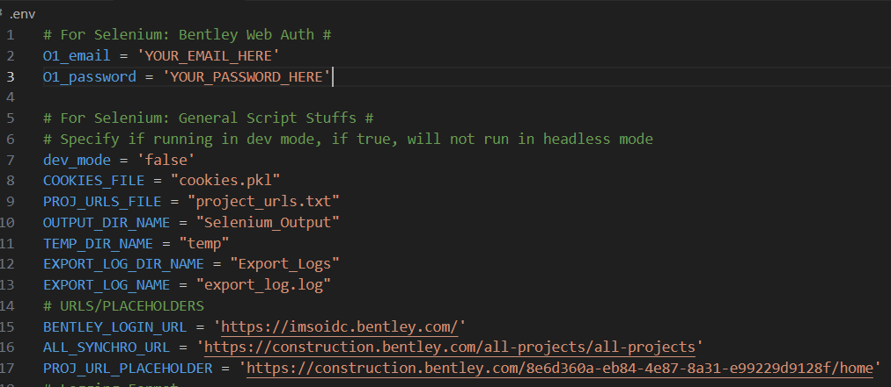
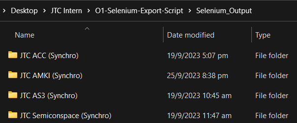
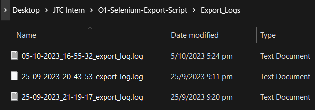
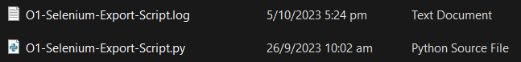
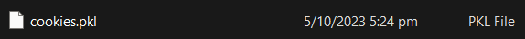

<h1 align="center">O1 Selenium Export Script</h1>

<div align="center">

[]()
[](/LICENSE)

</div>

---

<p align="center"> Selenium Script to automate exporting of Synchro Forms from O1.
    <br> 
</p>

## 📝 Table of Contents

- [About](#about)
- [Getting Started](#getting_started)
- [Usage](#usage)
- [Built Using](#built_using)
- [Authors](#authors)

## 🧐 About <a name = "about"></a>

This script is used to automate the exporting of Synchro Forms from O1.
It uses Selenium to automate the process of logging into O1 and exporting the forms.
It also uses Watchdog to monitor the 'Selenium_Output/temp' folder for new files and move them to their respective project output folder.
Full URLs of the projects to be exported are stored in 'project_urls.txt' file.

Cookies are used to store the login session so that the user does not have to login every time the script is run, however the cookies will expire after a certain amount of time, if the script is not run for a while, the user will have to login again.
User credentials are stored in a .env file and are not included in the repository.


## 🏁 Getting Started <a name = "getting_started"></a>

These instructions will get you a copy of the project up and running on your local machine for development and testing purposes, as well as production use.

### Prerequisites

What things you need to install the software and how to install them.


- [Python](https://www.python.org/downloads/) Version 3.7 and Above.

### Installing

A step by step series of examples that tell you how to get a development env running.

Install the required python packages using the following command.

```bash
pip install -r requirements.txt
```

Edit project_urls.txt to include the urls of the projects you want to export.

```bash
Example:
https://construction.bentley.com/eb43529c-a051-454c-9bd4-5c883ed8ecb8/home
Note: Each url has to be on a new line!
```
Open cmd/terminal and make a copy of sample.env and rename it to .env.

```bash
cp sample.env .env
```

Open up .env file in notepad and fill in the .env file with your O1 credentials. You may also change the output folder name if you wish to but it is not necessary.

```bash
Example:
O1_email=example_username
O1_password=example_password
```



## 🎈 Usage <a name="usage"></a>

To run the script, use the following command.

```bash
python O1-Selenium-Export-Script.py
```

- Exported files will be saved in the 'Selenium_Output' folder.

    

- A 'temp' folder will be created in the 'Selenium_Output' folder to store temporary files.

    

- Export logs will be saved in the 'Export_Logs' folder.
    - Inside you will be able to find a log file for each script run.
    - Each log file will contain the project name that the script was run on and the status of the export such as any errors e.g. due to skipped pages and total exported forms.

    

- Script logs will be saved in the current folder with the same name as the script.

    

- 'cookies.pkl' file will be saved after logging in, for use during script re-run.

    


## ⛏️ Built Using <a name = "built_using"></a>

- [Python](https://www.python.org/) - Programming Language
- [Selenium](https://www.selenium.dev/) - Web Automation Framework
- [ChromeDriver](https://chromedriver.chromium.org/) - WebDriver for Chrome
- [Watchdog](https://pythonhosted.org/watchdog/) - Filesystem Monitoring API

## ✍️ Authors <a name = "authors"></a>

- [@xKhronoz](https://github.com/xkhronoz) - Author
